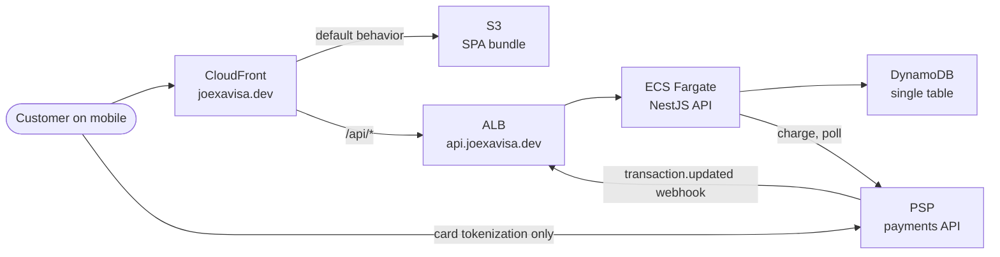
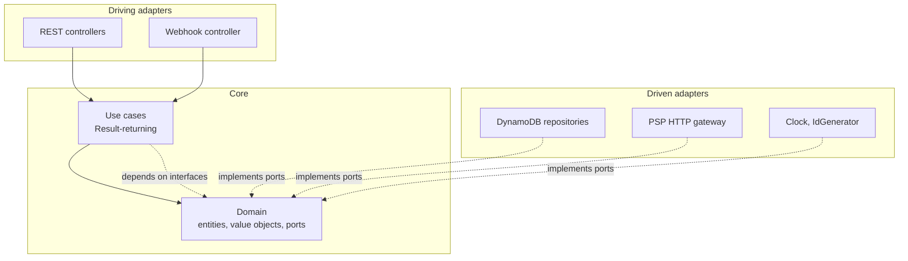
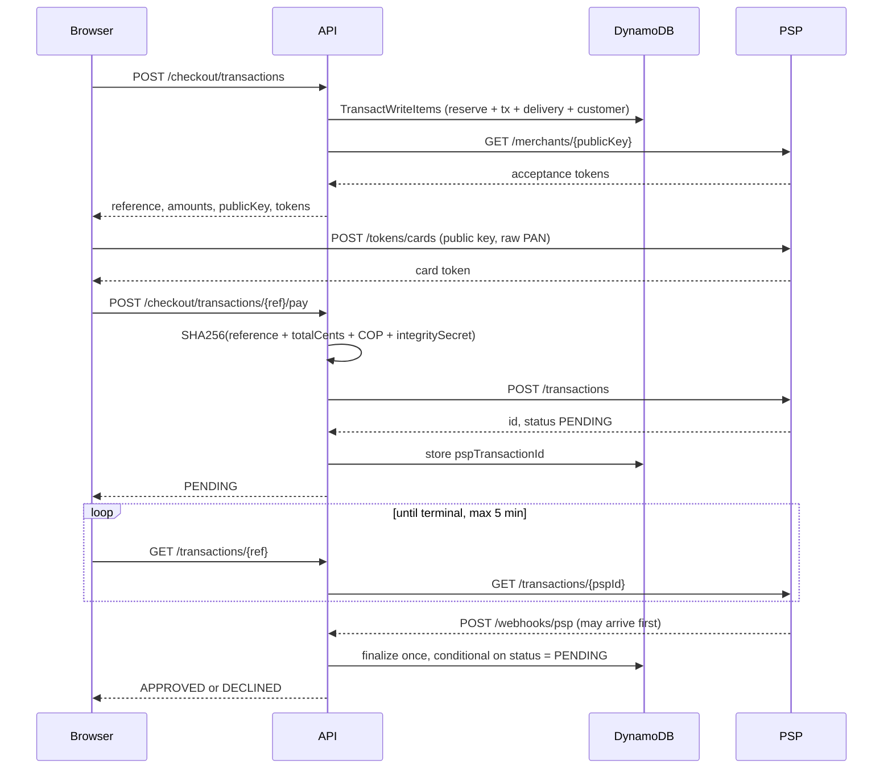

# Architecture

Backend and system architecture for the Norte checkout. Frontend contract is in [design-spec.md](./design-spec.md); persistence is in [data-model.md](./data-model.md).

The payment provider is referred to only as the **PSP**. Its hostname and keys arrive through configuration and are never committed.

## 1. System context



Two things in this diagram carry most of the design weight.

**One CloudFront distribution serves both origins.** The SPA is the default behaviour; `/api/*` forwards to the ALB. The browser therefore only ever talks to one origin, which removes CORS entirely, gives the API the CDN's TLS and edge termination, and lets a single response-headers policy cover the whole app.

**The browser talks to the PSP directly, exactly once**, to exchange the raw card number for a token using the public key. That arrow is why the PAN never reaches our servers, our logs, or our database.

## 2. The hexagon

One bounded context, one hexagon. Products, transactions, customers, and deliveries are aggregates inside it, not separate contexts — four copies of `domain/application/infrastructure` would be ceremony without benefit at this size.



The dependency rule points inward: `domain` imports nothing, `application` imports only `domain`, `infrastructure` may import both. This is enforced by an ESLint `no-restricted-imports` zone config, so a violation fails CI rather than quietly rotting.

Ports are interfaces paired with a `Symbol` token, which makes `app.module.ts` the only place an adapter is chosen:

```ts
{ provide: PRODUCT_REPOSITORY, useClass: DynamoProductRepository }
```

Tests override that one line with an in-memory fake. No mocking framework, no partial stubs of the AWS SDK.

## 3. Railway Oriented Programming

Expected failures are **values**, not exceptions. Only genuinely unexpected faults (a bug, a dead socket) throw and hit the global filter.

```ts
type Result<T, E> = { ok: true; value: T } | { ok: false; error: E };
```

Combinators in `shared/result.ts`: `ok`, `err`, `map`, `mapErr`, `andThen`, `match`, `all`, `fromPromise`. Every use case returns `Promise<Result<Output, DomainError>>`, and the happy path reads as a single track:

```ts
return (await this.products.find(cmd.productId))
  .andThen((product) => product.reserve(cmd.hours))
  .andThen((reservation) => this.pricing.quote(reservation))
  .andThen((quote) => this.transactions.start(quote, cmd.customer, cmd.delivery));
```

The first `err` short-circuits the rest. This is the ROP bonus, and it is also what keeps controllers free of `try/catch` pyramids.

### Error taxonomy

`DomainError` is a discriminated union on `code`. One mapper turns it into HTTP:

| Error | Status | Notes |
| --- | --- | --- |
| `VALIDATION_ERROR` | 400 | from `class-validator`, whitelisted DTOs |
| `PRODUCT_NOT_FOUND`, `TRANSACTION_NOT_FOUND` | 404 | |
| `INSUFFICIENT_STOCK` | 409 | includes remaining hours so the client can clamp |
| `DUPLICATE_REFERENCE` | 409 | |
| `INVALID_TRANSACTION_STATE` | 409 | illegal state transition |
| `PAYMENT_DECLINED` | **200** | see below |
| `PSP_UNAVAILABLE` | 502 | timeout or 5xx from the provider |
| `INVALID_EVENT_SIGNATURE` | 401 | webhook checksum mismatch |
| `RATE_LIMITED` | 429 | |

A **declined card is not an HTTP error**. The request succeeded; the business outcome was a decline. Returning 4xx there would be a protocol misuse, and it forces clients into error handling for a normal path. The response is `200` with `status: "DECLINED"` and a reason. This is deliberate — the spec grades correct use of HTTP.

## 4. Request lifecycle

```
ALB → helmet → CORS → rate limiter → correlation-id middleware
    → ValidationPipe (whitelist + forbidNonWhitelisted)
    → Controller  (no business logic)
    → Use case    (Result track)
    → Ports       (DynamoDB / PSP adapters)
    → Result mapper → status + serialized body
    → pino access log (redacted)
```

Controllers do three things: accept a validated DTO, call exactly one use case, `match` the `Result`. Anything else belongs in the core.

## 5. API reference

Base path `/api`. Swagger UI at `/docs`, OpenAPI JSON at `/docs-json`, Postman collection in `docs/postman/`.

### Catalogue

- **`GET /api/products`** → `200` with `[{ productId, name, description, unit, unitPriceCents, currency, usdUnitPrice, available, image }]`. `available` is `stock - reserved`.
- **`GET /api/products/:productId`** → `200` single product, `404` if unknown or inactive.
- **`GET /api/stock/:productId`** → `200 { productId, available, unit }`. Cheap endpoint the product page re-polls after a purchase.

### Checkout

- **`POST /api/checkout/transactions`** → `201`.

  Request: `{ productId, hours, customer: { email, fullName, phone, legalId, legalIdType }, delivery: { addressLine1, addressLine2?, city, region, postalCode?, country, phone } }`

  Response: `{ transactionReference, status: "PENDING", amounts: { itemCents, baseFeeCents, deliveryFeeCents, totalCents }, currency: "COP", psp: { publicKey, acceptanceToken, acceptPersonalAuthToken, policyLinks } }`

  Reserves stock, creates customer, transaction, and delivery in one atomic write. **The server computes `amounts`** — the client never sends a total. Errors: `409 INSUFFICIENT_STOCK`, `404 PRODUCT_NOT_FOUND`, `400`.

- **`POST /api/checkout/transactions/:reference/pay`** → `200`.

  Request: `{ cardToken, installments, acceptanceToken, acceptPersonalAuth, cardBrand, cardLast4 }`. Optional `Idempotency-Key` header.

  Response: `{ transactionReference, status, statusMessage?, amounts }`.

  Computes the integrity signature server-side, submits the charge, stores `pspTransactionId`. Guarded by the `status = PENDING` condition, so a double tap cannot double charge. Errors: `409 INVALID_TRANSACTION_STATE`, `502 PSP_UNAVAILABLE`.

- **`GET /api/transactions/:reference`** → `200 { reference, status, statusMessage?, amounts, card: { brand, last4 }, product: { name, hours }, finalizedAt? }`.

  The polling endpoint. While `PENDING` it queries the PSP; on the first terminal status it finalizes atomically (commit or release stock, assign the product to the delivery) before responding.

### Customers, deliveries, webhook, health

- **`GET /api/customers/:customerId`** → `200`, PII minimised in the payload.
- **`GET /api/deliveries/:reference`** → `200 { status, recipientName, address, assignedProductId?, assignedQuantity?, assignedAt? }`.
- **`PATCH /api/deliveries/:reference`** → `200`. Address correction, allowed only while the delivery is `PENDING`; `409` afterwards.
- **`POST /api/webhooks/psp`** → `200` always once the checksum verifies, because the provider retries on any non-2xx. `401` on checksum mismatch.
- **`GET /health`** → `200 { status, version }`. ALB target-group check, no dependency calls, so a DynamoDB blip does not cycle healthy tasks.

Across the four required resources this exercises `GET`, `POST`, and `PATCH` with real status-code variety, which is what the spec asks for.

## 6. Payment flow



Key properties:

- **Signature is server-side only.** `SHA256(reference + amountInCents + currency + integritySecret)`, lowercase hex, computed from the stored amount — never from a client-supplied number.
- **Nothing is synchronous.** Every transaction starts `PENDING` and settles later, so polling *and* the webhook both exist. Neither is optional: polling gives the UI a fast answer, the webhook is the authoritative catch-up if the user closes the tab.
- **Finalization is idempotent.** Polling and webhook race by design; the conditional `status = PENDING` update means exactly one wins and the loser is a successful no-op.
- **Sandbox outcomes are driven by card number**: `4242 4242 4242 4242` approves, `4111 1111 1111 1111` declines, anything else errors.
- **Webhook checksum** is `SHA256(<signature.properties values in order> + timestamp + eventsSecret)`, compared case-insensitively. The `properties` array is read from the payload rather than hardcoded, because the provider documents that it can change.

## 7. Deployment

All Terraform, `us-east-1` (CloudFront certificates must live there, so one region keeps ACM simple).

- **VPC** with two public subnets only. Fargate tasks run with `assign_public_ip = true` behind a security group that accepts traffic solely from the ALB. This deliberately avoids a NAT gateway and its ~$32/month, which would otherwise be the largest line item.
- **ECS Fargate**, 0.25 vCPU / 512 MB, one task, rolling deploys with the circuit breaker and automatic rollback.
- **ALB** with an ACM certificate for `api.joexavisa.dev` and HTTP→HTTPS redirect.
- **S3 + CloudFront** for the SPA: private bucket, Origin Access Control, `403/404 → /index.html` for client-side routing, and a response-headers policy carrying HSTS, CSP, `X-Content-Type-Options`, `Referrer-Policy`, and `Permissions-Policy`.
- **Secrets** in SSM Parameter Store as `SecureString`, injected via the task definition's `secrets` block. Never baked into the image, never in the repository.
- **GitHub OIDC** provider and deploy roles, so CI holds no long-lived AWS keys.

`.dev` is on the HSTS preload list, so HTTPS is mandatory throughout — there is no HTTP fallback to lean on during debugging.

### Pipelines

`ci.yml` (lint, typecheck, tests, coverage gate) on PRs. `deploy-web.yml` builds and syncs to S3 with immutable cache headers on hashed assets and `no-cache` on `index.html`, then invalidates. `deploy-api.yml` builds `linux/amd64`, pushes to ECR tagged with the commit SHA, registers a task-definition revision, and waits for service stability. `terraform.yml` plans on PRs and applies on `main` behind a protected environment.

## 8. Security

- **PAN never touches the backend.** Tokenization happens in the browser against the PSP with the public key. The database stores only brand and last four digits.
- **Key separation.** Public key reaches the client. Private key, integrity secret, and events secret stay server-side in SSM. Three distinct secrets with three distinct purposes; none is interchangeable.
- **Amounts are server-authoritative.** The signed amount comes from the stored transaction, so a tampered client cannot alter what is charged.
- **Input validation** with `whitelist` and `forbidNonWhitelisted`, so unknown fields are rejected rather than silently persisted.
- **Rate limiting** via `@nestjs/throttler`, tightest on the pay endpoint.
- **Webhook authenticity** verified by checksum before any state change; unverified events are dropped with `401`.
- **Redacted logging.** pino redaction paths cover `email`, `phone`, `legalId`, `cardToken`, and anything card-shaped. No request body is logged wholesale.
- **No stack traces in responses**; the global filter returns a correlation id instead.
- **Security headers** at CloudFront so they apply to both origins. CSP `connect-src` must include the PSP tokenization host, since the browser calls it directly.
- **Least-privilege IAM** — the task role gets six DynamoDB actions on one table and one index.

Target: an A grade on Mozilla Observatory, which covers the OWASP bonus.

## 9. Observability

Structured JSON logs via pino, one line per request with method, route, status, duration, and a correlation id propagated from `X-Request-Id` (generated when absent) into every downstream call. CloudWatch log group with 14-day retention. `finalizedAt - createdAt` is logged on terminal transactions so settlement latency is measurable. A CloudWatch alarm on sustained 5xx at the ALB. Graceful `SIGTERM` handling with `app.enableShutdownHooks()` so rolling deploys drain in-flight requests instead of dropping them.

## 10. Configuration

Validated at boot with a schema; the process refuses to start on a missing or malformed variable, which turns a 3am misconfiguration into a failed deploy.

API: `PORT`, `NODE_ENV`, `LOG_LEVEL`, `AWS_REGION`, `TABLE_NAME`, `DYNAMODB_ENDPOINT` (local only), `PSP_BASE_URL`, `PSP_PUBLIC_KEY`, `PSP_PRIVATE_KEY`, `PSP_INTEGRITY_SECRET`, `PSP_EVENTS_SECRET`, `PRICING_BASE_FEE_CENTS`, `PRICING_DELIVERY_FEE_CENTS`, `RESERVATION_TTL_SECONDS`, `CORS_ORIGIN`.

Web: `VITE_API_BASE_URL`, `VITE_PSP_PUBLIC_KEY`, `VITE_PSP_TOKENIZATION_URL`.

`PSP_BASE_URL` is configuration rather than a constant partly for environment switching and partly because the provider's hostname contains its company name, which the spec forbids in the repository. `.env.example` documents every variable with placeholder values only.

## 11. Testing strategy

Jest both sides, 80% global coverage threshold enforced in CI.

- **Domain** — pure functions and entity invariants: stock reservation maths, the transaction state machine, `Money` construction, Luhn and brand detection, signature and checksum computation against the documented worked examples. Fast, no I/O, and where most of the coverage comes from.
- **Use cases** — against in-memory repository fakes and a fake `PaymentGateway`. Covers both rails: out of stock, already paid, declined, provider timeout, duplicate webhook.
- **Adapters** — DynamoDB repositories against DynamoDB Local, including a concurrent-reservation test that asserts two simultaneous checkouts for the last hour produce exactly one success. That single test is the one that proves the model.
- **HTTP** — `supertest` over the real controller stack with fakes wired in, asserting status codes and payload shapes, including that a decline returns `200`.

## 12. Decision log

- **Single hexagon, not one per aggregate.** Checkout is one bounded context; four triplets would be ceremony. Boundaries are enforced by lint instead of folder depth.
- **Reference as primary key.** The PSP echoes `reference` in webhooks, so this removes an index and a lookup.
- **Reservation counter plus lazy sweep.** Conditional writes need a scalar to test against, and the sweep repairs drift without Lambda, EventBridge, or a Streams consumer.
- **`200` for declines.** The HTTP request succeeded; the payment outcome is data.
- **Single CloudFront distribution with two origins.** Kills CORS, unifies TLS and security headers.
- **Public subnets for Fargate.** Trades a small amount of architectural purity for skipping a $32/month NAT gateway; the security group still admits only the ALB.
- **No web fonts on the frontend.** Removes a render-blocking request and makes CLS structurally zero.
- **Jest over Vitest.** The spec mandates Jest, so Vite gets `@swc/jest` even though Vitest would be less setup.
