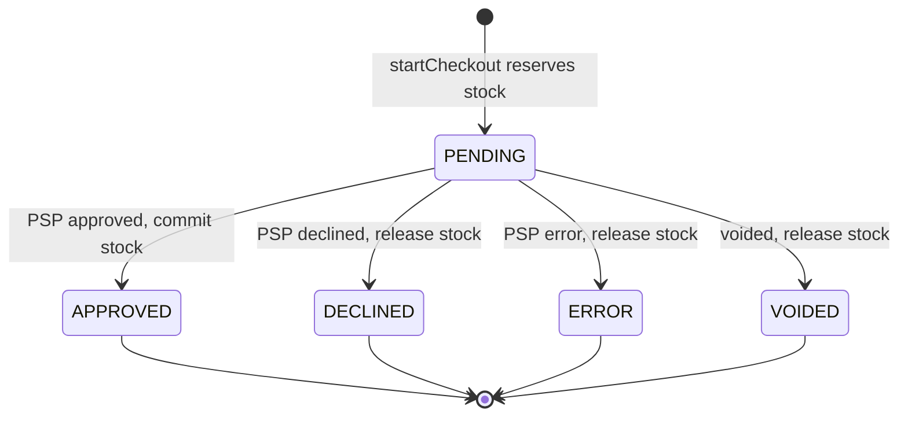

# Data model

Single DynamoDB table, four entities (product, transaction, customer, delivery) plus two supporting item types. Every application read is a `GetItem` or a `Query` — **there is no `Scan` anywhere in application code**.

The payment provider is referred to only as the **PSP**.

## 1. Table configuration

- Table name from config, e.g. `norte-main`.
- Keys: `PK` (partition, `S`), `SK` (sort, `S`).
- One global secondary index **GSI1**: `GSI1PK` / `GSI1SK`, both `S`, **sparse** — only items that need indexing carry the attributes.
- Billing mode `PAY_PER_REQUEST`. No capacity planning, scales to zero cost when idle.
- Point-in-time recovery enabled.
- TTL enabled on the `ttl` attribute (epoch **seconds**).
- Encryption at rest with the AWS-managed key.

GSI1 projection is **`ALL`**. The table holds a handful of products and a low volume of transactions, so the storage duplication is negligible and it avoids fetch-back round trips. A high-volume system would switch to `INCLUDE` with a named attribute list; that is the one deliberate simplification here.

## 2. Key schema

Every item carries `entityType`, `createdAt`, `updatedAt` (ISO 8601), and `schemaVersion`.

### Product

```
PK      PRODUCT#<productId>
SK      PRODUCT#<productId>
GSI1PK  PRODUCT                      (constant, so one Query lists the catalog)
GSI1SK  <name>                        (alphabetical listing)
```

| Attribute | Type | Notes |
| --- | --- | --- |
| `productId` | S | ULID |
| `name` | S | `JoeXavi Dev Hours` |
| `description` | S | two-line copy for the product page |
| `unit` | S | `HOUR` — quantity means hours |
| `unitPriceCents` | N | `5000000` (50.000 COP) |
| `currency` | S | `COP` (the PSP settles COP only) |
| `usdUnitPrice` | N | `20` — display label only |
| `usdRateCop` | N | `2500` — fixed test rate, display only |
| `stock` | N | units **owned**, seed `48` |
| `reserved` | N | units held by in-flight checkouts |
| `imageKey`, `imageWidth`, `imageHeight`, `imageAlt` | S/N | explicit dimensions so the client can reserve space and keep CLS at 0 |
| `active` | BOOL | soft delete |

Availability is **derived, never stored**: `available = stock - reserved`.

### Transaction

The internal `reference` *is* the id. That is the single most useful decision in this model: the PSP echoes `reference` back in webhook payloads, so event handling is a direct `GetItem` with no secondary index and no lookup table.

```
PK      TX#<reference>
SK      TX#<reference>
GSI1PK  TXSTATUS#PENDING             (present only while PENDING)
GSI1SK  <createdAt>
```

| Attribute | Type | Notes |
| --- | --- | --- |
| `reference` | S | `NOR-<ULID>`, unique, ≤255 chars (PSP limit) |
| `productId`, `quantity` | S/N | quantity is hours |
| `customerId` | S | |
| `amounts` | M | `{ itemCents, baseFeeCents, deliveryFeeCents, totalCents }` |
| `currency` | S | `COP` |
| `status` | S | `PENDING` / `APPROVED` / `DECLINED` / `VOIDED` / `ERROR` |
| `statusMessage` | S | PSP reason, e.g. `Insufficient funds` |
| `pspTransactionId` | S | set when the charge is submitted |
| `card` | M | `{ brand, last4 }` — **never** PAN, CVC, or expiry |
| `attempts` | N | charge submissions, for abuse detection |
| `paidAt`, `finalizedAt` | S | |

`GSI1PK`/`GSI1SK` are **removed** on finalization. The index therefore contains only in-flight transactions and stays tiny, which makes the reconciliation query cheap regardless of history size.

### Delivery

Stored in the **same item collection** as its transaction, so one `Query` returns the whole order in a single read.

```
PK      TX#<reference>
SK      DELIVERY#<reference>
```

One delivery per transaction, so the delivery id is the transaction reference. That means `GET /api/deliveries/:id` resolves without a second index.

| Attribute | Type | Notes |
| --- | --- | --- |
| `recipientName`, `phone` | S | |
| `addressLine1`, `addressLine2`, `city`, `region`, `postalCode`, `country` | S | |
| `status` | S | `PENDING` / `ASSIGNED` / `CANCELLED` |
| `assignedProductId`, `assignedQuantity`, `assignedAt` | S/N/S | the "assign the product to the customer" step, written only on approval |

### Customer

```
PK      CUSTOMER#<customerId>
SK      CUSTOMER#<customerId>
GSI1PK  EMAIL#<sha256(lowercased email)>
GSI1SK  CUSTOMER
```

Email lookup uses a **hash** in the index key, not the address itself. Lookup still works (hash the incoming query), but no plaintext email ends up in key material or index metadata. The address is kept as a normal `email` attribute for display and for the PSP call.

Other attributes: `fullName`, `phone`, `legalId`, `legalIdType` (`CC` / `CE` / `NIT` / `PP` / `TI`).

### Stock reservation

```
PK      PRODUCT#<productId>
SK      RESERVATION#<reference>
```

Attributes: `quantity`, `reference`, `expiresAt` (epoch seconds, now + 15 min), `ttl` (`expiresAt + 3600`).

Two separate timestamps on purpose. `expiresAt` drives application logic; `ttl` is a garbage collector with an hour of slack, so DynamoDB never deletes an item the sweeper still needs to reason about.

### Idempotency record (optional)

```
PK      IDEMPOTENCY#<key>
SK      IDEMPOTENCY#<key>
```

Written with `attribute_not_exists(PK)` when a client sends an `Idempotency-Key` on the pay endpoint. Stores the first response so a retry replays it. `ttl` of 24h. Secondary defence — the primary guard is the conditional state transition in section 4.

## 3. Access patterns

Every pattern the application needs, with the exact operation:

1. **List catalogue** → `Query` GSI1 where `GSI1PK = PRODUCT`.
2. **Get product** → `GetItem` `PRODUCT#<id>` / `PRODUCT#<id>`.
3. **Get availability** → same `GetItem`, return `stock - reserved`.
4. **Start checkout** (reserve + create customer, transaction, delivery) → one `TransactWriteItems`, section 4.
5. **Get transaction by reference** → `GetItem` `TX#<ref>` / `TX#<ref>`.
6. **Get full order** (transaction + delivery) → `Query` `PK = TX#<ref>`.
7. **Handle PSP webhook** → `GetItem` on the reference carried in the event payload.
8. **Find customer by email** → `Query` GSI1 where `GSI1PK = EMAIL#<sha256>`.
9. **Get customer** → `GetItem` `CUSTOMER#<id>`.
10. **Get delivery** → `Query` `PK = TX#<ref>`, `SK begins_with DELIVERY#`.
11. **Finalize approved** → one `TransactWriteItems`, section 4.
12. **Release declined / errored** → one `TransactWriteItems`, section 4.
13. **Sweep expired reservations** → `Query` `PK = PRODUCT#<id>`, `SK begins_with RESERVATION#`, filter `expiresAt < now`.
14. **Reconcile stuck transactions** → `Query` GSI1 where `GSI1PK = TXSTATUS#PENDING` and `GSI1SK < now - 5min`.

## 4. Stock correctness

This is where a checkout actually breaks in production, so it gets explicit treatment. Three invariants:

- `reserved <= stock` always.
- A single transaction reference can reserve **once**.
- A transaction can be finalized **once**, regardless of how many times polling and the webhook race each other.

All three are enforced by DynamoDB, not by application sequencing.

### Reserve — `TransactWriteItems`

1. `Update` product: `SET reserved = reserved + :qty` with optimistic-lock `ConditionExpression: attribute_exists(PK) AND active = :true AND reserved = :expectedReserved AND stock >= :minStock` (where `:expectedReserved` is the reserved count from the pre-read and `:minStock = expectedReserved + :qty`).
2. `Put` reservation with `ConditionExpression: attribute_not_exists(PK)`.
3. `Put` transaction (`PENDING`) with `ConditionExpression: attribute_not_exists(PK)` — enforces reference uniqueness.
4. `Put` delivery.
5. `Put` customer (or `Update` if the email hash already resolves).

All five commit or none do. A `TransactionCanceledException` whose reasons include the product's condition failure maps to `InsufficientStock`; a reference collision maps to `DuplicateReference`. The adapter inspects `CancellationReasons` per item rather than treating the whole exception as one failure — that distinction is what lets the API return a precise error.

### Finalize approved — `TransactWriteItems`

1. `Update` product: `SET stock = stock - :qty, reserved = reserved - :qty` with condition `reserved >= :qty AND stock >= :qty`.
2. `Update` transaction: set `status = APPROVED`, `finalizedAt`, and **`REMOVE GSI1PK, GSI1SK`**, with condition `status = :pending`.
3. `Delete` the reservation.
4. `Update` delivery: `status = ASSIGNED`, `assignedProductId`, `assignedQuantity`, `assignedAt`.

The `status = PENDING` condition is the idempotency guard. Whichever of polling or webhook arrives second fails that condition, and the use case treats "already finalized" as success rather than an error — so a duplicate webhook is a no-op instead of a double stock decrement.

### Release declined, errored, or expired

Same shape, but the product update is only `SET reserved = reserved - :qty` (condition `reserved >= :qty`), the transaction takes its terminal status, and the delivery becomes `CANCELLED`. Stock returns to the pool.

### Abandoned checkouts

A customer who closes the tab mid-payment leaves `reserved` inflated. TTL alone does **not** fix this: TTL deletes the reservation item but runs no application logic, so the counter on the product would drift permanently. Worth stating plainly because it is an easy thing to get wrong.

The fix is a **lazy sweep**. Before every reserve, and on every product read, the repository runs access pattern 13 and releases anything past `expiresAt`, capped at 25 reservations per request to bound latency. The system is self-healing on traffic, needs no Lambda, no EventBridge schedule, and no DynamoDB Streams consumer. TTL then removes the dead items an hour later purely as housekeeping.

## 5. Transaction state machine



Terminal states never transition again. `PENDING → PENDING` is a legal no-op (the PSP has not settled yet). Any other transition is rejected by the conditional update and surfaces as `InvalidTransactionState` (HTTP 409).

## 6. Money

Integer **cents** everywhere, in DynamoDB's exact-decimal `N` type. No floats, no `parseFloat`, no currency arithmetic in the client.

`hours × 5000000 + 150000 + 800000`. For 3 hours: `15000000 + 150000 + 800000 = 15950000` cents = **159.500 COP**.

Largest realistic value is 48 hours (`240150000` cents), far below `Number.MAX_SAFE_INTEGER`, so plain JS numbers are safe. The `Money` value object still guards construction: integers only, non-negative, `COP` only.

The client displays the breakdown but never computes it. Totals come from the server, which is also what gets hashed into the PSP integrity signature — so a tampered client total cannot produce a valid charge.

## 7. Seeding

`pnpm --filter api seed` writes the single SKU with `attribute_not_exists(PK)`, so it is idempotent and safe to re-run in CI or against production. Per the spec there is no product-creation endpoint.

Seed values: `JoeXavi Dev Hours`, `unitPriceCents 5000000`, `stock 48`, `reserved 0`, `active true`.

## 8. Local development

`docker-compose.yml` runs DynamoDB Local plus an admin UI. `pnpm --filter api db:setup` creates the table and GSI1 from the **same** definition the Terraform module uses, kept in one JSON file so local and deployed schemas cannot drift. Integration tests create a uniquely named table per run and drop it afterwards.

## 9. Access control

The ECS task role is scoped to exactly one table and its index, with only the six actions in use:

```
dynamodb:GetItem, Query, PutItem, UpdateItem, DeleteItem, TransactWriteItems
Resource: arn:aws:dynamodb:<region>:<acct>:table/norte-main
          arn:aws:dynamodb:<region>:<acct>:table/norte-main/index/GSI1
```

No `Scan`, no `DeleteTable`, no wildcard resources. PII lives only in customer and delivery items; nothing sensitive is logged (the logger redacts `email`, `phone`, `legalId`, and anything card-shaped), and PAN and CVC never reach the backend at all because tokenization happens in the browser.
