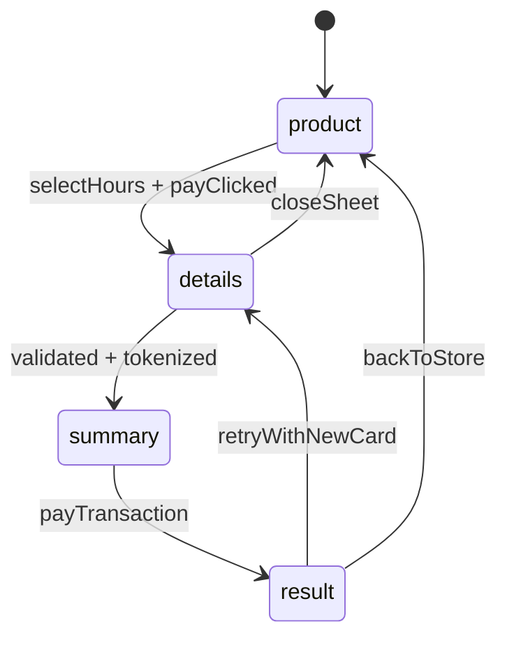

# Frontend design spec

Scope: `apps/web` — the mobile-first SPA for the **Norte** store. This document is the contract the implementation follows: tokens, components, screens, state, validation, and acceptance criteria. Backend contract lives in [architecture.md](./architecture.md) and [data-model.md](./data-model.md).

The payment provider is referred to only as the **PSP**. Its name must not appear in code, folder names, env vars, copy, or commit messages.

## 1. Product and pricing

Single SKU, quantity is **hours**.

- Name: **JoeXavi Dev Hours** — senior full-stack pairing time.
- Display price: **USD 20 / hour**, with `COP 50.000 billed per hour` as helper text.
- Charged currency: **COP only** (the PSP settles COP). Fixed test rate `2.500 COP per USD`.
- Unit price: `5_000_000` cents (50.000 COP).
- Base fee: `150_000` cents (1.500 COP), always added.
- Delivery fee: `800_000` cents (8.000 COP).
- Seed stock: **48 hours**. Selectable range: `1 .. min(available, 48)`.

Worked example for 3 hours: `150.000 + 1.500 + 8.000 = 159.500 COP`.

The client **displays** the breakdown but never authors it. Totals shown on the summary screen come from the `POST /api/checkout/transactions` response so the client and server can never disagree.

## 2. Design tokens

Declared once as CSS custom properties in `src/styles/tokens.css`, consumed by CSS Modules. No hardcoded hex outside this file.

### Color

| Token | Value | Use |
| --- | --- | --- |
| `--color-bg` | `#F6F3EE` | page background (warm paper) |
| `--color-surface` | `#FFFFFF` | cards, sheet, inputs |
| `--color-text` | `#1C1917` | primary type |
| `--color-text-muted` | `#6B6560` | labels, helper text |
| `--color-border` | `#E3DDD3` | hairlines, input borders |
| `--color-primary` | `#0F4C5C` | CTAs, focus ring, links |
| `--color-primary-hover` | `#0B3A46` | pressed CTA |
| `--color-success` | `#3F6B54` | approved |
| `--color-success-tint` | `#E7EFE8` | stock + approved pills |
| `--color-danger` | `#A8442A` | declined, field errors |
| `--color-danger-tint` | `#F7E7E1` | declined pill |
| `--color-pending` | `#8A5A1E` | pending status |
| `--color-pending-tint` | `#F6EBDA` | pending pill |
| `--color-scrim` | `rgb(28 25 23 / 0.48)` | modal/backdrop scrim |

All pairs meet WCAG AA (4.5:1) for body text; white on `--color-primary` and on `--color-danger` both exceed 4.5:1.

### Typography

No web fonts. System stacks only, so there is zero font download and zero layout shift.

- `--font-display: ui-serif, Georgia, "Times New Roman", serif`
- `--font-sans: -apple-system, BlinkMacSystemFont, "Segoe UI", Roboto, sans-serif`

Mobile scale (rem-based, root 16px):

| Role | Size / line-height | Weight | Family |
| --- | --- | --- | --- |
| Display title | 28px / 1.15 | 600 | display |
| Price | 32px / 1.1 | 600 | sans, `tabular-nums` |
| Section heading | 18px / 1.3 | 600 | sans |
| Body | 16px / 1.5 | 400 | sans |
| Label | 13px / 1.2 | 600 | sans |
| Helper / caption | 13px / 1.4 | 400 | sans |
| Button | 16px / 1 | 600 | sans |

Inputs are **16px minimum** — anything smaller triggers iOS Safari zoom on focus. All money uses `font-variant-numeric: tabular-nums`.

### Space, radius, motion

- Space scale: `4, 8, 12, 16, 20, 24, 32, 40, 48` as `--space-1 … --space-9`. Side padding is `--space-4` (16px).
- Radii: `--radius-sm: 8px`, `--radius-md: 12px` (inputs), `--radius-lg: 20px` (cards, sheet), `--radius-pill: 999px`.
- Motion: enter `180ms cubic-bezier(0.2, 0, 0, 1)`, exit `140ms ease-in`. Sheet enters `translateY(100%) → 0`. Everything wrapped in `@media (prefers-reduced-motion: reduce)` to become instant.
- Z-index: header `10`, scrim `100`, sheet `110`, toast `200`.

### Layout

- Baseline viewport **375 × 667** CSS px (iPhone SE 2020 — the spec's `1334 × 750` is device px at 2×).
- Breakpoints: `480px` large phone, `768px` tablet, `1024px` desktop.
- Content max-width `1120px`; sheet and backdrop max-width `420px`, centered above `480px`.
- Use `100dvh` (never `100vh`) and `env(safe-area-inset-*)` for the sticky footer.
- Minimum touch target `44 × 44px`.
- Layout via flex and grid only — no float, no positioning hacks for layout.

## 3. Component inventory

All in `src/components/ui/`, all typed, all unit-tested. Every interactive component forwards `ref`, accepts `className`, and renders a native element underneath.

- **`Button`** — variants `primary | ghost | danger`, optional `fullWidth`, `loading`. Loading shows a spinner, sets `aria-busy="true"`, and keeps the label so width does not jump. Disabled is never used for validation-blocked CTAs; instead the CTA stays enabled and submits, then focuses the first invalid field (better for screen readers and avoids dead-end buttons).
- **`Field`** — wraps label + control + helper/error. Wires `htmlFor`, `aria-describedby`, `aria-invalid`. Error text replaces helper text and is announced via `role="alert"`.
- **`CardNumberInput`** — formats in groups of four, `inputMode="numeric"`, `autocomplete="cc-number"`, `maxLength=23`. Renders the detected `BrandIcon` **inside** the field on the trailing edge. Brand icons appear nowhere else in the app.
- **`ExpiryInput`** — auto-inserts `/` after MM, `autocomplete="cc-exp"`.
- **`CvcInput`** — 3–4 digits, `autocomplete="cc-csc"`, `inputMode="numeric"`. Value lives in local component state only and is never dispatched to Redux.
- **`BrandIcon`** — inline SVG for `visa | mastercard | unknown`. Inline so there is no extra request and no flash.
- **`Stepper`** — the hours control. Minus/plus buttons, `aria-label="Hours"`, value in an `aria-live="polite"` region, clamps to `1 .. available`, buttons disable at the bounds.
- **`Pill`** — tones `neutral | success | danger | pending`.
- **`Sheet`** — the bottom-sheet modal. Focus trap, focus restore to the trigger on close, `Escape` and scrim click both close, body scroll locked, `role="dialog"` + `aria-modal="true"` + `aria-labelledby`.
- **`Backdrop`** — Material backdrop: a collapsed front strip over a revealed back layer, with `aria-expanded` on the strip.
- **`Money`** — formats cents with `Intl.NumberFormat('es-CO', { style: 'currency', currency: 'COP', maximumFractionDigits: 0 })`. Cents-to-COP division happens here and only here.
- **`Skeleton`** — fixed-dimension placeholders for hero and price, so there is no CLS while loading.
- **`ErrorBanner`** — message plus a retry action.

## 4. Screens

Routes: `/` → `/checkout` → `/checkout/summary` → `/checkout/result` → `/`.

### Screen 1 — Product (`/`)

Hero image, then a sage `{n} hours available` pill, serif title, `USD 20 / hour` with the COP helper line, a two-line description, the **Hours** stepper, and a full-width primary CTA **Pay with credit card**.

- Hero is WebP with explicit `width`/`height`, `fetchpriority="high"`, and a `<link rel="preload">`. No lazy loading — it is the LCP element.
- Stock `0` replaces the CTA with a disabled **Sold out** state.
- Above `768px` the hero and the purchase column sit side by side; the CTA stays visible without scrolling.

### Screen 2 — Card and delivery (`/checkout`)

A `Sheet` over a dimmed product page. Two sections in one form.

- **Card:** number, expiry + CVC in a two-column row, cardholder name. Helper text `Test cards only`.
- **Delivery:** email, full name, phone, address line 1, address line 2 (optional), city, region. Required by the spec even though the product is a service.
- Sticky footer: **Continue to summary**.
- Validation runs on blur and again on submit. On submit failure, focus moves to the first invalid field.
- On success the card is tokenized **in the browser** against the PSP using the public key, so the PAN never touches our API. Only `brand`, `last4`, and the returned token enter Redux.

### Screen 3 — Summary (`/checkout/summary`)

Material backdrop. Front strip shows `JoeXavi Dev Hours × {n}h` and `{brand} •••• {last4}`. Back layer shows the server-computed breakdown: hours subtotal, base fee, delivery fee, hairline, total, with the USD equivalent as helper text. Then the delivery address block, then two required acceptance checkboxes linking the PSP policy permalinks. CTA: **Pay COP {total}**.

- The CTA is the only place a charge is initiated. It sets `loading`, disables re-entry, and is guarded server-side by the transaction state machine so a double tap cannot double charge.
- Both checkboxes must be ticked; the acceptance tokens are fetched fresh (they are short-lived JWTs) and never persisted.

### Screen 4 — Result (`/checkout/result`)

While `PENDING`: a status card with a spinner, the reference, and `This usually takes a few seconds`. Polling backs off `1s → 2s → 3s` and caps at **5 minutes**; on timeout the screen shows the reference and a manual **Check again**.

- **Approved:** sage check, `Payment approved`, `{n} pairing hours are booked.`, receipt (reference, `{brand} •••• {last4}`, hours, total, `APPROVED` pill, address), ghost **Back to store**.
- **Declined / error:** terracotta mark, `Payment declined`, `Nothing was charged. Those hours are available again.`, the PSP reason string, primary **Try another card** (returns to `/checkout` with delivery preserved and card fields cleared) and ghost **Back to store**.

### Screen 5 — Product again

**Back to store** clears the checkout slice, refetches the product, and shows the decremented hours.

## 5. State and persistence

Redux Toolkit, slices plus `createAsyncThunk`. Two slices: `products` and `checkout`.

```ts
type CheckoutState = {
  step: 'product' | 'details' | 'summary' | 'result';
  hours: number;
  productId: string | null;
  customer: { email; fullName; phone; legalId; legalIdType } | null;
  delivery: { addressLine1; addressLine2?; city; region; postalCode?; country } | null;
  card: { brand: 'visa' | 'mastercard' | 'unknown'; last4: string; token: string } | null;
  acceptance: { termsAccepted: boolean; dataAccepted: boolean };
  transaction: { id; reference; status; breakdown } | null;
  ui: { tokenizing: boolean; submitting: boolean; error: string | null };
};
```

### Wizard transitions



### Persistence rules

A small middleware writes a whitelisted subset of `checkout` to `localStorage` under a versioned key (`norte.checkout.v1`); a version bump discards old state instead of migrating.

- **Persisted:** `step`, `hours`, `productId`, `customer`, `delivery`, `card.brand`, `card.last4`, `transaction`, `acceptance`.
- **Never persisted, never in Redux:** PAN, CVC, expiry.
- `card.token` is persisted only while a transaction is in flight and is cleared on any terminal status. It is single-use and short-lived, so it is treated as a credential with a 30-minute TTL stamped alongside it.

### Rehydration on load

1. Persisted `transaction.status === 'PENDING'` → route straight to `/checkout/result` and resume polling.
2. Terminal status → show the result once; clear on **Back to store**.
3. No transaction but `step` is `details` or `summary` → restore the forms and return to that step.
4. Stale entry (TTL expired or schema mismatch) → discard and start at `/`.

This is what satisfies the spec's requirement that the app recover client progress across a refresh.

## 6. Validation

Client validation is a UX affordance; the server re-validates everything.

| Field | Rule | Message |
| --- | --- | --- |
| Card number | Luhn valid, 13–19 digits | `Enter a valid card number` |
| Card brand | must resolve to VISA or Mastercard | `Only Visa and Mastercard are accepted` |
| Expiry | `MM/YY`, month 1–12, not in the past | `Enter a valid expiry date` |
| CVC | 3 digits (4 for Amex-length BINs) | `Enter the 3-digit code` |
| Cardholder | 2–60 chars, letters and spaces | `Enter the name on the card` |
| Email | RFC-ish single `@`, valid domain shape | `Enter a valid email` |
| Phone | 7–15 digits, optional `+` | `Enter a valid phone number` |
| Address line 1 | 5–100 chars | `Enter your address` |
| City / Region | required, 2–60 chars | `Required` |
| Hours | integer, `1 .. available` | `Choose between 1 and {available} hours` |
| Acceptance | both boxes ticked | `You must accept both policies to continue` |

Brand detection by BIN: `4` → Visa; `51–55` or `2221–2720` → Mastercard; anything else `unknown`. Detection is live as the user types and drives the in-field icon.

Sandbox behaviour to surface in helper text: `4242 4242 4242 4242` approves, `4111 1111 1111 1111` declines.

## 7. Errors

- `409 OUT_OF_STOCK` → return to `/`, banner `Only {n} hours left`, clamp the stepper.
- `409 TRANSACTION_ALREADY_PAID` → jump to the result screen for that reference rather than charging again.
- Tokenization failure → keep the sheet open, banner above the card section, PAN retained so the user can correct a typo.
- Network failure on pay → the transaction may already exist, so **never** silently retry. Poll by reference and show the outcome.
- Poll timeout → show the reference with **Check again**; never assume failure.

## 8. Performance and accessibility

Budgets: LCP under 1.5s on simulated 4G, **CLS 0**, initial JS under 150KB gzipped. Route-level code splitting so the checkout bundle is not on the product page's critical path. Hero WebP under 60KB, served immutable from CloudFront. Every image has explicit dimensions.

Accessibility: one `h1` per screen, labels on all inputs, visible `:focus-visible` ring using `--color-primary`, focus trap and restore in the sheet, `role="alert"` on errors, `aria-live` on the hours value and the polling status, full keyboard operability, AA contrast throughout. Verified on iOS Safari, Chrome, and Firefox.

The Content-Security-Policy must allow `connect-src` to the PSP tokenization host, since the browser calls it directly.

## 9. Testing

Jest + jsdom + React Testing Library + MSW, `@swc/jest` for transforms (the spec mandates Jest, so Vitest is out). Global coverage threshold **80%**, enforced in CI.

Query by role and label, not by test id. Reserve `data-testid` for the few non-semantic hooks: `hours-stepper`, `card-brand-icon`, `summary-total`, `result-status`.

Required test cases:

- Luhn, brand detection, and expiry validators as pure-function tables.
- Money formatting from cents, including the 159.500 example.
- Stepper clamping at both bounds.
- Sheet focus trap, `Escape` close, and focus restore.
- Reducer transitions for all wizard edges in the diagram.
- Persistence middleware never writes PAN, CVC, or expiry — asserted against the serialized payload.
- Rehydration for all four cases in section 5.
- Full happy path with MSW: approved transaction decrements displayed hours.
- Declined path preserves delivery data and clears the card.
- Double-tap on pay dispatches exactly one request.

## 10. Open decisions

- **Copy language.** Specced in English to match the mockups; all strings live in `src/copy.ts` so switching to Spanish is one file. Currency stays `es-CO` formatted regardless.
- **Reference mockups** live outside the repo. Copy them into `docs/mockups/` during implementation so the README can link them.
